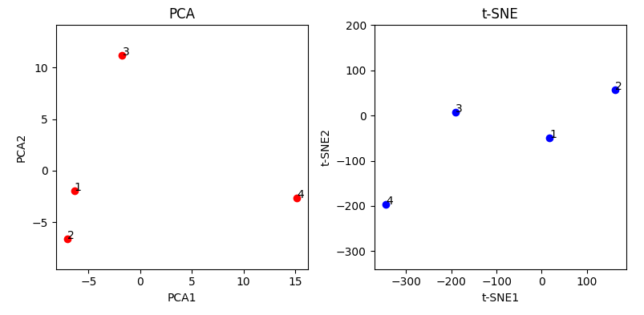

[TOC]

# LangChain 介绍

整体流程：

<u>文档通过 pdf 读取 + 分词 + 向量化 保存到数据库中</u>

<u>根据提问检索数据库，找出相关上下文段落</u>

<u>LangChain 将 上下文 + 提问 整合到一起，输入给 ada/davinci/chatgpt 等语言模型</u>

<u>返回字符串，进行输出</u>

参考项目：

LangChain - 打造自己的GPT（二）simple-chatpdf

https://github.com/HappyGO2023/simple-chatpdf

https://zhuanlan.zhihu.com/p/620422560

基于本地知识的 ChatGLM 应用实现

https://github.com/imClumsyPanda/langchain-ChatGLM

## 1. 准备环境

### 1.1 新建环境

创建环境

```shell
conda activate -n chat python=3.9
```

conda 换源（可以跳过）

```
conda config --add channels https://mirrors.tuna.tsinghua.edu.cn/anaconda/cloud/msys2/
conda config --add channels https://mirrors.tuna.tsinghua.edu.cn/anaconda/cloud/conda-forge
conda config --add channels https://mirrors.tuna.tsinghua.edu.cn/anaconda/pkgs/free/
conda config --add channels https://mirrors.tuna.tsinghua.edu.cn/anaconda/cloud/pytorch/
conda config --add channels https://mirrors.tuna.tsinghua.edu.cn/anaconda/pkgs/main/
conda config --set show_channel_urls yes

conda config --add channels https://mirrors.ustc.edu.cn/anaconda/pkgs/main/
conda config --add channels https://mirrors.ustc.edu.cn/anaconda/pkgs/free/
conda config --add channels https://mirrors.ustc.edu.cn/anaconda/cloud/conda-forge/
conda config --add channels https://mirrors.ustc.edu.cn/anaconda/cloud/msys2/
conda config --add channels https://mirrors.ustc.edu.cn/anaconda/cloud/bioconda/
conda config --add channels https://mirrors.ustc.edu.cn/anaconda/cloud/menpo/
conda config --set show_channel_urls yes

conda clean -i
```

### 1.2 安装依赖

conda 太慢了，考虑用 pip 安装

首先先装 torch，直接下载本地文件（需要按照自己的 cuda 版本进行选择）

https://download.pytorch.org/whl/cu117/torch-2.0.0%2Bcu117-cp39-cp39-win_amd64.whl

```shell
# 在线安装
pip install torch --index-url https://download.pytorch.org/whl/cu117
# 本地安装（推荐）
pip install torch-2.0.0+cu117-cp39-cp39-win_amd64.whl
```

然后装依赖，主要是 langchain 库和 openai 库

可以参考 https://github.com/HappyGO2023/simple-chatpdf 的 requirements.txt

```shell
# 一键安装
pip install -r requirements.txt -i https://pypi.tuna.tsinghua.edu.cn/simple
# langchain依赖
langchain
PyPDF2
chromadb
tiktoken
# openai依赖
openai
# chatglm依赖
protobuf
transformers==4.27.1
cpm_kernels
torch>=1.10
sentencepiece
accelerate
```

如果后续调用 OpenAI 的时候报错，则需要降级 urllib3

```shell
pip install urllib3==1.25.11
```

## 2. 开通 OpenAI API

### 2.1 账号免费额度

LangChain 整合了多种语言模型，包括 openai api、本地模型等

<u>作为实验，我们先使用 OpenAI 的接口，然后再换成本地的模型</u>

<u>每个 OpenAI 账号里会有免费的额度，需要注意检查有没有过期</u>

\$5 免费额度，调用 gpt-3.5-turbo \$0.002 / 1K tokens，可以使用很久

下面的提示是没钱的报错：

```
Retrying langchain.llms.openai.completion_with_retry.<locals>._completion_with_retry in 4.0 seconds as it raised RateLimitError: You exceeded your current quota, please check your plan and billing details..
```

### 2.2 不同模型的价格

https://platform.openai.com/account/usage 查询账号的用量

https://platform.openai.com/docs/models/gpt-3-5 查看不同的模型

https://openai.com/pricing#language-models 查看不同的价格

主要有三种模型：GPT-4，GPT-3.5 (Chat)，GPT-3 (InstructGPT)

<u>语言模型可以选 gpt-3.5-turbo (ChatGPT) 或者 ada</u>

<u>Embedding 模型目前只有 ada 开放，不需要选择</u>

| Model         | Price / 1K tokens |
| ------------- | ----------------- |
| gpt-4         | $0.03             |
| gpt-4-32k     | $0.06             |
| gpt-3.5-turbo | $0.002            |
| davinci       | $0.02             |
| curie         | $0.002            |
| babbage       | $0.0005           |
| ada           | $0.0004           |

https://codechina.org/2023/02/openai-gpt-api-summarize/ GPT-3 各模型区别

LangChain 里面的默认模型：

**OpenAI**类默认对应 “text-davinci-003” 版本：

```python3
OpenAI(temperature=0)
```

**OpenAIChat**类默认是 "gpt-3.5-turbo"版本：

```python3
OpenAIChat(temperature=0)
```


## 3. 试验 OpenAI 接口 (普通 LLM)

去 Anaconda 装一个 JupyterLab，开一个笔记本

### 3.1 设置环境信息

然后填入环境信息，访问 OpenAI 需要挂代理

https://github.com/zhayujie/chatgpt-on-wechat/issues/351

我用 SSR 开启 “允许来自局域网的连接”，将端口设成 1080

网络流向：Python - 1080 端口 - SSR - OpenAI

如果是不同的代理软件，可能需要配置不同端口

```python
import os
# 填入自己的 OpenAI Key
os.environ["OPENAI_API_KEY"] = "Key"
# 设置代理端口
os.environ["HTTP_PROXY"] = "127.0.0.1:1080"
os.environ["HTTPS_PROXY"] = "127.0.0.1:1080"
```

### 3.2 使用普通 LLM（ada）问答

设置语言模型

```python
from langchain.llms import OpenAI
llm = OpenAI(model_name="text-ada-001", temperature=0.9)
```

然后就可以开始问答了，只需要输入你的指令或者问题

```python
text = "Please introduce yourself."
print(llm(text))
```

奇奇怪怪的回答

```
I am a 28-year-old singleartist who is looking for a relationship that is serious and interested in 2-3 years of experience in the artist base.
```

设置一个 prompt 模板，可以向模板填入参数，不用每次写一个完整的 prompt

```python
from langchain.prompts import PromptTemplate

prompt = PromptTemplate(
    input_variables=["chara"],
    template="Introduce yourself as {chara}",
)
```

```python
prompt.format(chara="a musician")

'Introduce yourself as a musician in one sentence.'
```

创建一个 chain，将 llm 和 prompt 结合起来，实现一键调用

```python
from langchain.chains import LLMChain
chain = LLMChain(llm=llm, prompt=prompt)

result = chain.run("the Dragonborn of The Elder Scrolls")
print(result)
```

ada 返回的结果，有点乱

```python
I am the Dragonborn, the invoking and battle-ready! I am the —

Frosty, the Tauren player character who began the trend ofistic skin blue eyes and The Elder ScrollsSSSS

I am the Dragonborn, the invoking and battle-ready! I am the

Tauren, the infant god- alerted by the call of the rising sun! I am

the Tauren, the infant god- alerted by the call of the rising sun!
```


## 4. 试验 ChatModels 接口

LLM 接口是输入一段文本，输出一段文本

Chat models 则是 LLM 的一个变种，接口复杂一点，从简单文本变成了聊天信息

```python
from langchain.chat_models import ChatOpenAI
from langchain.schema import (
    AIMessage,
    HumanMessage,
    SystemMessage
)

chat = ChatOpenAI(model="gpt-3.5-turbo", temperature=0.7)
```

通过 HumanMessage 和模型进行交互

```python
messages = [HumanMessage(content="请介绍一下你自己.")]

result = chat(messages)
```

```python
content='我是一个人工智能语言模型，被称为OpenAI的GPT-3。我可以回答各种问题，生成文章、对话和其他文本形式的内容。我可以学习和理解不同的语言和主题，并尽可能地回答问题和提供有用的信息。' additional_kwargs={}
```

通过 SystemMessage 对模型提供对话的背景信息，再用 HumanMessage 做具体问答

```python
messages = [
    SystemMessage(content="You are the Dragonborn in The Elder Scrolls."),
    HumanMessage(content="请介绍一下你自己.")
]

result = chat(messages)
```

```python
content='我是龙裔，又称为龙降临者，是《上古卷轴》系列游戏中的主角。我是一个强大的战士、法师和盗贼，可以使用龙语法术和武器来打败敌人。我的任务是抵御龙的入侵，并拯救天际省的人民。我还可以加入各种组织，如黑暗兄弟会、盗贼公会和战士公会，并完成许多任务和副本。总之，我是一个英勇的冒险家，致力于保护天际省和居民的安全。' additional_kwargs={}
```

SystemMessage 是系统告诉 gpt 的信息，可以要求 gpt 作为一个怎么样的身份去交互（你是一个对人类友好的人工智能助手），并且提供一些要求（你的回答需要友好、理性、完善，拒绝不道德的提问）

HumanMessage 是人类用户对 gpt 的问答内容


聊天信息相应的也会有 Template 和 Chain

对应的 Agent 和 Memory 则会更加复杂一点


## 5. LangChain 的基本概念

### 5.1 Models

模型可以是 OpenAI 接口，也可以是本地部署的模型

LLMs：普通语言模型，输入一段话输出一段话

Chat Models：对话模型，输入输出的格式包括AI信息、系统信息、用户信息等，支持流式回答（一个一个字打出来）

Text Embedding Models：用于文本向量化，输入文本输出一组浮点数

### 5.2 Prompt/PromptTemplate

提示和提示模板，作为模型的输入

### 5.3 Chain

流程链，简单的链就三步：从模板创建 prompt，将 prompt 输入到模型，得到输出。其中输入模型和获取输出是一起的

**chain_type**

stuff：直接将所有 doc 丢给 llm，可能会超 token

map_reduce：每个 doc 进行总结，再做整体总结

refine：总结1+doc2=总结2，总结2+doc3=总结3，......

map_rerank：对每个 doc 计算匹配度，选择最高分数的 doc 给 llm 做回答

### 5.4 Agent

https://zhuanlan.zhihu.com/p/619344042 详解

LLM作为驾驶员，根据用户的输入动态调用 Chain/Tool

核心概念：

- Tool：例如 google 搜索、数据库检索、Python 等等，可供调用。一般输入输出都是字符串。每个 tool 都有一段语言描述，相当于说明书
- LLM：语言模型
- Agent：需要使用的代理。`zero-shot-react-description`、`react-docstore` 等多种预设类型

`zero-shot-react-description`：根据每个 tools 的描述，选择出需要的 tool

```python
agent = initialize_agent(tools, llm, agent=AgentType.ZERO_SHOT_REACT_DESCRIPTION, verbose=True)

agent.run("What was the high temperature in SF yesterday in Fahrenheit? What is that number raised to the .023 power?")
```

```
> Entering new AgentExecutor chain...
 I need to find the temperature first, then use the calculator to raise it to the .023 power.
Action: Search
Action Input: "High temperature in SF yesterday"
Observation: San Francisco Temperature Yesterday. Maximum temperature yesterday: 57 °F (at 1:56 pm) Minimum temperature yesterday: 49 °F (at 1:56 am) Average temperature ...
Thought: I now have the temperature, so I can use the calculator to raise it to the .023 power.
Action: Calculator
Action Input: 57^.023
Observation: Answer: 1.0974509573251117

Thought: I now know the final answer
Final Answer: The high temperature in SF yesterday in Fahrenheit raised to the .023 power is 1.0974509573251117.

> Finished chain.
```

https://liaokong.gitbook.io/llm-kai-fa-jiao-cheng/


### 5.5 Memory

向 Chain 和 Agent 添加状态，例如短期记忆或长期记忆

```python
from langchain.memory import ChatMessageHistory
from langchain.chat_models import ChatOpenAI

chat = ChatOpenAI(temperature=0)

# 初始化 MessageHistory 对象
history = ChatMessageHistory()

# 给 MessageHistory 对象添加对话内容
history.add_ai_message("你好！")
history.add_user_message("中国的首都是哪里？")

# 执行对话
ai_response = chat(history.messages)
print(ai_response)
```


## 6. simple-chatpdf

项目地址

https://github.com/HappyGO2023/simple-chatpdf

首先参考 embedding.py 进行知识库存储，然后参考 qa.py 进行知识库问答

jupyter notebook 实现


整体流程

1. 把你的内容拆成一块块的小文件块、对块进行了Embedding后放入向量库索引 （为后面提供语义搜索做准备）。

2. 搜索的时候把Query进行Embedding后通过语义检索找到最相似的K个Docs。

3. 把相关的Docs组装成Prompt的Context，基于相关内容进行QA，让GPT进行In Context Learning，用人话回答问题。

### 6.1 载入 PDF

使用 PyPDF2.PdfReader 将 pdf 加载进来

```python
import PyPDF2

pdf_path = 'KOS：2023中国市场招聘趋势.pdf'
pdf_file = open(pdf_path, 'rb')
pdf_reader = PyPDF2.PdfReader(pdf_file)

pdf_content = ''
for num in range(len(pdf_reader.pages)):
    page = pdf_reader.pages[num]
    pdf_content += page.extract_text()
```

pdf_reader.pages[x] 就是每一页的内容，包括了很多格式之类的信息

pdf_reader.pages[x].extract_text() 将每一页的文字提取出来，存入 pdf_cotent 字符串

一个 89 页的 PDF 可以有 34400 字

### 6.2 文档清洗

全文档字符串 >> 分句 >> 多句合并成段

pdf_content 将所有内容保存成一个字符串

首先需要将换行洗掉

然后按照句子结束符号（；。！？等），拆分成一句句话

```python
pdf_content = pdf_content.replace('\n', '') 
pdf_content = pdf_content.replace('\n\n', '') 
pdf_content = re.sub(r'\s+', ' ', pdf_content)

pdf_sentences_mark = re.split('(；|。|！|\!|\.|？|\?)', pdf_content) 

pdf_sentences = []
for i in range(int(len(pdf_sentences_mark)/2)):
    sent = pdf_sentences_mark[2*i] + pdf_sentences_mark[2*i+1]
    pdf_sentences.append(sent)
if len(pdf_sentences_mark) % 2 == 1:
    pdf_sentences.append(pdf_sentences_mark[len(pdf_sentences_mark)-1])
```

接下来将多个句子拼成一段，按照最大长度 300 为一段

最后得到一个 paragraphs，list 类型，每个元素为一段字符串，len < 300

这样我们就把完整的 PDF 拆分成了一段段小文本

也可以用 langchain.text_splitter.CharacterTextSplitter 来尝试

```python
paragraphs = []
max_len = 300
current_len = 0
current_para = ""

for sent in pdf_sentences:
    sent_len = len(sent)
    if current_len + sent_len <= max_len:
        current_para += sent
        current_len += sent_len
    else:
        paragraphs.append(current_para.strip())
        current_para = sent
        current_len = sent_len

paragraphs.append(current_para.strip())
```

### 6.3 文档保存

文字需要保存成 langchain.docstore.document.Document 类型

分好的每一段是一个小 Document

包含 page_content 文本内容，metadata 是自己填写的信息字段，用于数据库检索

```python
Document(page_content='xxx', metadata={'source':'xxx, ...})
```

把每个小 Document 放进一个 documents list 里

整个 documents[ ] 就是完整的 pdf

```python
from langchain.docstore.document import Document

documents = []
metadata = {"source": pdf_path}
for para in paragraphs:
    new_doc = Document(page_content=para, metadata=metadata)
    documents.append(new_doc)
```

### 6.4 文档 Embedding 持久化

这些 Documents 需要变成文件保存起来

LangChain 提供了一个向量数据库 Chroma

需要安装 `pip install tiktoken`

将 documents 传入 Chroma，用 OpenAI 接口做成 Embeddings，然后持久化到 db_openai 目录

```python
from langchain.embeddings.openai import OpenAIEmbeddings
from langchain.vectorstores import Chroma

embedding = OpenAIEmbeddings()
persist_directory = 'db_openai'

vectordb = Chroma.from_documents(documents=documents, embedding=embedding, persist_directory=persist_directory)

vectordb.persist()
```

### 6.5 本地 Embedding 

首先我们需要下载整个项目

https://huggingface.co/shibing624/text2vec-base-chinese

可能需要安装 text2vec 库，不知道是否必要

```shell
pip install text2vec
```

将 OpenAI Embedding 替换成本地 Embedding

注意持久化目录，不同 Embedding 模型的目录需要区分，否则会在写入时报错

（可以试一下改成 persist_directory = 'db_openai'，看看发生什么错误）

```python
from langchain.embeddings import HuggingFaceEmbeddings
from langchain.vectorstores import Chroma

embedding = HuggingFaceEmbeddings(model_name=r'D:\Projects\text2vec-base-chinese')
persist_directory = 'db_huggingface'

vectordb = Chroma.from_documents(documents=documents, embedding=embedding, persist_directory=persist_directory)

vectordb.persist()
```

### 6.6 数据库读取

用 Chroma.as_retriever 创建一个 retriever，作为数据库的检索器

```python
vectordb = Chroma(persist_directory='db', embedding_function=embedding)
retriever = vectordb.as_retriever(search_kwargs={"k": 3})
```

根据 query，用 retriever 查找出最相关的 k 个 Document（段落）

创建一个 prompt_template，需要填入的参数为 context 和 query

```python
from langchain.prompts import PromptTemplate

prompt_template="""请注意：请谨慎评估Query与提示的Context信息的相关性，只根据本段输入文字信息的内容进行回答，如果Query与提供的材料无关，请回答"我不知道"，另外也不要回答无关答案：
    Context: {context}
    Query: {query}
    Answer:"""

prompt = PromptTemplate(
    input_variables=["context", "query"],
    template=prompt_template
)

query = '2022年国内新能源车的渗透率是多少?'
docs = retriever.get_relevant_documents(query)
```

LangChain 中自带 load_qa_chain，可以整合 ChatOpenAI 和 Prompt，基于 docs 进行问答

```python
from langchain.chains.question_answering import load_qa_chain
from langchain.chat_models import ChatOpenAI

chain = load_qa_chain(ChatOpenAI(temperature=0), chain_type="stuff", prompt=prompt)
```

运行 chain 时填入参数，context = 查找出来的 docs，query = 你的提问

```python
result = chain({"input_documents": docs, "query": query}, return_only_outputs=True)
print(result)
```


## 7. LangChain + ChatGLM

### 7.1 LangChain 引入 ChatGLM

在前面我们将 OpenAI Embedding 换成了本地 Embedding 模型 text2vec-base-chinese

接下来我们将 OpenAI LLM 换成本地 LLM 模型 ChatGLM-6B

ChatGLM 的部署参考官方文档，这里不做详细介绍

https://github.com/THUDM/ChatGLM-6B

### 7.1.1 ChatGLM 类封装

尽管 LangChain 支持了 OpenAI、LLaMA、GPT4ALL、Hugging Face 等多种模型，但是没有预设的 ChatGLM 类。因此需要自己创建一个类

类的实现参考项目中的 models/chatllm.py

https://github.com/imClumsyPanda/langchain-ChatGLM

基于 LangChain 的 LLM 基类，创建 ChatGLM 类

构造函数 \_\_init\_\_ 参考 ChatGLM 官方的加载，使用 transformers 库加载

析构函数 \_\_del\_\_ 使用 torch.cuda.empty_cache() 手动回收显存，否则只有关闭程序才会释放

调用函数 _call 根据 prompt 输出回答，输入输出都是字符串

（具体的方法参考 8.8 Custom LLM）

```python
# ChatGLM.py
from typing import Any, List, Mapping, Optional
from langchain.llms.base import LLM
from langchain.callbacks.manager import CallbackManagerForLLMRun
from transformers import AutoTokenizer, AutoModel, AutoConfig

import torch


def torch_gc():
    # with torch.cuda.device(DEVICE):
    torch.cuda.empty_cache()
    torch.cuda.ipc_collect()
    

class ChatGLM(LLM):
    max_token: int = 10000
    temperature: float = 0.01
    top_p = 0.9
    tokenizer: object = None
    model: object = None

    def __init__(
        self,
        model_path: str = "chatglm-6b-int4",
        **kwargs
    ):
        super().__init__()
        self.tokenizer = AutoTokenizer.from_pretrained(
            model_path,
            trust_remote_code=True, 
            revision=model_path
        )
        model_config = AutoConfig.from_pretrained(
            model_path, 
            trust_remote_code=True, 
            revision=model_path
        )
        self.model = AutoModel.from_pretrained(
            model_path, 
            config=model_config, 
            trust_remote_code=True, 
            revision=model_path, 
            **kwargs
        ).half().cuda()
        self.model = self.model.eval()

    def __del__(self):
        self.tokenizer = None
        self.model = None

        torch.cuda.empty_cache()        
    
    @property
    def _llm_type(self) -> str:
        return "ChatGLM"

    def _call(
        self, 
        prompt: str,
        stop: Optional[List[str]] = None,
        run_manager: Optional[CallbackManagerForLLMRun] = None
    ) -> str:
        if stop is not None:
            raise ValueError("stop kwargs are not permitted.")
        
        response, _ = self.model.chat(
            self.tokenizer,
            prompt,
            history=[],
            max_length=self.max_token,
            temperature=self.temperature,
        )
        torch_gc()
        return response
```

#### 7.1.2 ChatGLM 使用

引入 ChatGLM 和引入 OpenAI 类似，只需要声明即可

需要传入模型的路径

```python
llm = OpenAI()
llm = ChatGLM(model_path='../models/chatglm-6b-int4')
```

调用只需要传入字符串

```python
result = llm('你好')
print(result)

你好，我是 ChatGLM-6B，是清华大学KEG实验室和智谱AI公司于2023年共同训练的语言模型。我的任务是服务并帮助人类，但我并不是一个真实的人。
```

### 7.2 由 PDF 建立向量数据库

这部分是 6. simple-chatpdf 的扩展，将读取文档和建立向量数据库的流程封装起来


#### 7.2.1 封装 PDFLoader

首先我们需要将 PDF 读取封装成函数形式

输入是 pdf 的路径和 Document 的最大长度

输出是切分得到的 Document 列表

```python
# PDFLoader.py
import PyPDF2
import re
from langchain.docstore.document import Document


def PDFLoader(pdf_path: str, max_len: int = 300) -> list:
    with open(pdf_path, 'rb') as pdf_file:
        pdf_reader = PyPDF2.PdfReader(pdf_file)

        # Extract PDF content
        pdf_content = ''.join(page.extract_text() for page in pdf_reader.pages)

        # Clean up symbols
        pdf_content = re.sub(r'\n+', '', pdf_content)
        pdf_content = re.sub(r'\s+', ' ', pdf_content)

        # Split into sentences
        sentence_separator_pattern = re.compile('([；。！! \?？]+)')
        sentences = [
            element
            for element in sentence_separator_pattern.split(pdf_content)
            if not sentence_separator_pattern.match(element) and element
        ]

        # Merge sentences into paragraphs
        paragraphs = []
        current_length = 0
        current_paragraph = ""

        for sentence in sentences:
            sentence_length = len(sentence)
            if current_length + sentence_length <= max_len:
                current_paragraph += sentence
                current_length += sentence_length
            else:
                paragraphs.append(current_paragraph.strip())
                current_paragraph = sentence
                current_length = sentence_length

        paragraphs.append(current_paragraph.strip())
        
        documents = []
        metadata = {"source": pdf_path}
        for para in paragraphs:
            new_doc = Document(page_content=para, metadata=metadata)
            documents.append(new_doc)

    return documents
```

#### 7.2.2 创建向量数据库

声明一个向量数据库，需要指定 embedding 模型和数据库的本地保存目录

```python
import os
from langchain.embeddings import HuggingFaceEmbeddings
from langchain.vectorstores import Chroma

os.environ["TOKENIZERS_PARALLELISM"] = "false"
db_embedding = HuggingFaceEmbeddings(model_name='../models/text2vec-large-chinese/')
db_directory = '../vectordb/db_DBQA'

vectordb = Chroma(embedding_function=db_embedding, persist_directory=db_directory)
```

#### 7.2.3 添加文档到数据库

在上一步中我们声明了 vectordb 作为 Chroma 数据库（新建的数据库或者已有的数据库都可以）

使用 PDFLoader 将文档提取成 Document 列表，使用 add_documents 方法输入数据库

在完成更改后需要使用 persist 方法保存到本地目录

```python
file_path = '../files/'
file_list = ['2023中国市场招聘趋势.pdf',
             '数据要素白皮书-2022.pdf',
             '人工智能生成内容白皮书-2022.pdf']
```

一次输入一个文档：

```python
docs = []
for file in file_list:
    pdf_path = file_path + file
    docs.extend(PDFLoader(pdf_path, max_len=200))

vectordb.add_documents(docs)
vectordb.persist()
```

 一次输入多个文档：

```python
for file in file_list:
    pdf_path = file_path + file
    docs = PDFLoader(pdf_path, max_len=200)
    vectordb.add_documents(docs)
	vectordb.persist()
```

#### 7.2.4 查询数据库

和 6.6 查询数据库 方法一致，只需要声明一个 vectordb，然后创建一个 retriever 读取即可

```python
vectordb = None
vectordb = Chroma(embedding_function=db_embedding, persist_directory=db_directory)
retriever = vectordb.as_retriever(search_kwargs={"k": 3})

query = '介绍一下虚拟歌手洛天依'
docs = retriever.get_relevant_documents(query)
print(docs)
```

### 7.3 模型问答+对话历史

对话历史使用 ConversationBufferMemory

根据向量知识库回答使用 ConversationalRetrievalChain

#### 7.3.1 ConversationBufferMemory

模型加入对话历史的方式其实很简单，只需要在 prompt 前面加上每一轮的人类输出和AI输出即可。LangChain 官方提供了 Memory 功能，能够自动整合历史记录

使用的时候只需要向 chain 里引入 memory 参数即可11111111111111111

```python
from langchain.memory import ConversationBufferMemory
from langchain.llms import OpenAI
from langchain.chains import ConversationChain

llm = OpenAI(temperature=0)
conversation = ConversationChain(
    llm=llm, 
    verbose=True, 
    memory=ConversationBufferMemory()
)

conversation.predict(input="Hi there!")
```

#### 7.3.2 ConversationalRetrievalChain

https://python.langchain.com/en/latest/modules/chains/index_examples/chat_vector_db.html

这个 chain 和 RetrievalQAChain 差不多，都有基于向量数据库进行问答的功能，但是加上了对话历史

使用也非常简单（其中 llm 和 retriever 都是之前定义好的）

```python
from langchain.memory import ConversationBufferMemory
from langchain.chains import ConversationalRetrievalChain

memory = ConversationBufferMemory(memory_key="chat_history", return_messages=True)
chain = ConversationalRetrievalChain.from_llm(llm, retriever, memory=memory)
```

在调用时，将提问作为 question 参数传入 chain

返回的结果会包括 question/chat_history/answer 三部分内容

其中对话历史部分是 ChatHistory 类型，由 SystemMessage/HumanMessage/AIMessage 组成

```python
query = '请简单地介绍一下虚拟歌手洛天依'
result = chain({"question": query})

{'question': '请简单地介绍一下虚拟歌手洛天依',
 'chat_history': [HumanMessage(content='请简单地介绍一下虚拟歌手洛天依', additional_kwargs={}, example=False),
  AIMessage(content='洛天依是一个由VOCALOID语音合成引擎软件为基础创造出来的虚拟人物，由真人提供声源，再由软件合成人声，能够让粉丝深度参与共创。从2012年7月12日洛天依出道至今，音乐人以及粉丝已为洛天依创作了超过一万首作品，通过为用户提供更多想象和创作空间的同时，与粉丝建立了更深刻联系。洛天依的出道引起了全球范围内的关注，并成为了许多粉丝的虚拟偶像。', additional_kwargs={}, example=False)],
 'answer': '洛天依是一个由VOCALOID语音合成引擎软件为基础创造出来的虚拟人物，由真人提供声源，再由软件合成人声，能够让粉丝深度参与共创。从2012年7月12日洛天依出道至今，音乐人以及粉丝已为洛天依创作了超过一万首作品，通过为用户提供更多想象和创作空间的同时，与粉丝建立了更深刻联系。洛天依的出道引起了全球范围内的关注，并成为了许多粉丝的虚拟偶像。'}
```

#### 7.3.3 ConversationalRetrievalChain + Source

我们已经使用 chain 实现了基于数据库的问答，并加入了对话历史功能。接下来还可以在返回结果中加上依据的上下文

因此需要在声明 memory 的时候加上 return_messages=True，并指定输出字段 answer 和记忆字段 chat_history。这样就能在回答中加上 source_documents 字段

```python
memory = ConversationBufferMemory(output_key='answer', memory_key="chat_history", return_messages=True)
qa = ConversationalRetrievalChain.from_llm(llm, retriever, memory=memory, return_source_documents=True)
```

```python
query = '请简单地介绍一下虚拟歌手洛天依'
result = qa({"question": query})

{'question': '请简单地介绍一下虚拟歌手洛天依',
 'chat_history': [HumanMessage(content='请简单地介绍一下虚拟歌手洛天依', additional_kwargs={}, example=False),
  AIMessage(content='洛天依是一个由VOCALOID语音合成引擎软件为基础创造出来的虚拟人物，由真人提供声源，再由软件合成人声，能够让粉丝深度参与共创。从2012年7月12日洛天依出道至今，音乐人以及粉丝已为洛天依创作了超过一万首作品，通过为用户提供更多想象和创作空间的同时，与粉丝建立了更深刻联系。洛天依的出道引起了全球范围内的关注，并成为了许多粉丝的虚拟偶像。', additional_kwargs={}, example=False)],
 'answer': '洛天依是一个由VOCALOID语音合成引擎软件为基础创造出来的虚拟人物，由真人提供声源，再由软件合成人声，能够让粉丝深度参与共创。从2012年7月12日洛天依出道至今，音乐人以及粉丝已为洛天依创作了超过一万首作品，通过为用户提供更多想象和创作空间的同时，与粉丝建立了更深刻联系。洛天依的出道引起了全球范围内的关注，并成为了许多粉丝的虚拟偶像。',
 'source_documents': [Document(page_content='VOCALOID语音合成引擎软件为基础创造出来的虚拟人物，由真人提供声源，再由软件合成人声，都是能够让粉丝深度参与共创的虚拟歌手以洛天依为例，任何人通过声库创作词曲，都能达到“洛天依演唱一首歌”的效果从2012年7月12日洛天依出道至今十年的时间内，音乐人以及粉丝已为洛天依创作了超过一万首作品，通过为用户提供更多想象和创作空间的同时，与粉丝建立了更深刻联系二是通过', metadata={'source': '../files/人工智能生成内容白皮书-2022.pdf'}),
  Document(page_content='如欧莱雅、飞利浦、完美日记等品牌的虚拟主播一般会在凌晨0点上线，并进行近9个小时的直播，与真人主播形成了24小时无缝对接的直播服务二是虚拟化的品牌主播更能加速店铺或品牌年轻化进程，拉近与新消费人群的距离，塑造元宇宙时代的店铺形象，未来可通过延展应用到元宇宙中更多元的虚拟场景，实现多圈层传播如彩妆品牌“卡姿兰”推出自己的品牌虚拟形象，并将其引入直播间作为其天猫旗舰店日常的虚拟主播导购', metadata={'source': '../files/人工智能生成内容白皮书-2022.pdf'})]}
```

### Todo:

PDF Loader 封装成类

Chromadb新增文件

多轮对话context和history结合，不是只根据context

因为官方的 chain 使用的是英文 prompt，所以要不自己写chain要不自己写prompt

历史记录：modeling_chatglm.py

```python
RetrievalQAWithSourcesChain

_get_docs
	get_relevant_documents
    _reduce_tokens_below_limit
    
BaseQAWithSourcesChain       

_call
	_get_docs
    combine_documents_chain
    BaseCombineDocumentsChain
    	
```

## 8. Document QA 详细说明

这部分是对 simplepdf 的补充，基于官方文档，对整个读取文件进行 QA 的流程做详细说明

https://python.langchain.com/en/latest/modules/chains/index_examples/qa_with_sources.html

### 8.1 Indexes 总介绍

LangChain 基于 index 对 documents 做匹配

最基本的接口就是 retriever，根据 query 找到最相关的 k 个 documens

对于非结构化数据，例如文档，可以用 index 和 retrieve 来索引

而对于结构化数据，例如 csv，有相应数据类型的索引函数

主要的部分：

Document Loaders

Text Splitters

Vector Stores

Retrievers

### 8.2 Document Loaders

https://python.langchain.com/en/latest/modules/indexes/document_loaders.html

读取支持各种各样的文件格式

格式化文件：json，csv，dataframe，directory，markdown

多媒体：HTML，images，pdf，PPT

其他：bilibili，discord，email，git，gitbook，youtube


对于结构数据，像 csv、dataframe、数据库，一行就是一个 Document，page_content 保存行的主键，metadata 保存每一行的各个值

对于文档文件，像 HTML、markdown、PDF，需要分块成多个段落，每个段落就是一个 Document

对于非结构化数据，像 图片、Youtube 链接，还没弄明白怎么加载


官方预设了多种 Loader，每个 Loader 整合了第三方的库，例如 BS4、PyPDF 等，需要另外安装对应的库。可以自己使用这些库读取好文本，也可以直接用 Loader 加载

### 8.3 Text Splitter

如果用 Loader 加载结构化数据，一行一个 Doc，我们不需要自己进行分段

但是如果读取非结构化数据，例如一个 100 页的 PDF，我们不可能把全部内容一次性丢给 LLM


因此我们希望每一个 Doc 保存其中几页的内容，在用户进行提问的时候找到最相关的几个 Docs，让模型根据这几段内容进行回答

粗暴的划分方式是，直接按照长度将文章切开，可能会导致信息断开。理想的划分方式是，将相关的内容划分到同一个 Doc 里，保持上下文的完整性，但是需要对文章的语义做理解

（看 LangChain 官方文档似乎也没有根据上下文进行分割，只是做了简单的长度分段）


第一种划分方式，按照长度进行划分。将全篇文档拆成一句一句话，每次选择 N 句话组成一段，每段的总字数不超过 max_len

第二种划分方式，按照文档信息进行划分。如果文档自己有章节信息，则找到里面的章节进行划分

第三种划分方式，使用 Text Splitter 进行划分：

（按照知乎评论，默认 Splitter 对中文的理解能力不好。如果采用 Splitter 方式需要另外找中文适配的模型。不知道按长度划分方式和按 Splitter 划分方式的效果差别有多大）

LangChain 里整合了多种 Text Splitter，对文章进行分段，有 chunk_size/chunk_overlap 等参数

```python
from langchain.text_splitter import CharacterTextSplitter

with open("../../state_of_the_union.txt") as f:
    state_of_the_union = f.read()
text_splitter = CharacterTextSplitter(chunk_size=1000, chunk_overlap=0)
texts = text_splitter.split_text(state_of_the_union)

docsearch = Chroma.from_texts(texts, embeddings, metadatas=[{"source": str(i)} for i in range(len(texts))]).as_retriever()
```

 默认的选项就算 RecursiveCharacterTextSplitter

根据换行 '\\n', '\\n\\n' 等，将文章分段，假设 chunk_size = 100，chunk_overlap = 10

如果一个段小于 chunk 大小，则在一个 chunk 中装下尽可能多的段。例如三个段 30/65/20，chunk1 = 段 1+2，chunk2 = 段 3 

如果一个段大于 chunk 大小，那就分成两块，后面 chunk 的开头等于前面 chunk 的结尾

```python
# 原文
'Madam Speaker, Madam Vice President, our First Lady and Second Gentleman. Members of Congress and the Cabinet. Justices of the Supreme Court. My fellow Americans.  \n\nLast year COVID-19 kept us apart. This year we are finally together again. \n\n'

# 第一段太长，拆分成两个 chunk
Document(page_content='Madam Speaker, Madam Vice President, our First Lady and Second Gentleman. Members of Congress and', metadata={})
Document(page_content='of Congress and the Cabinet. Justices of the Supreme Court. My fellow Americans.', metadata={})
# 第二段完整放进 chunk 里
Document(page_content='Last year COVID-19 kept us apart. This year we are finally together again.', metadata={})
```

对于 chunk 长度计算，可以简单使用字符数，也可以使用 huggingface_tokenizer

对于 Latex，有 LatexTextSplitter，可以根据 \\section \\subsection 之类的标识符来划分

对于 Markdown，有 MarkdownTextSplitter，根据 # ## 等划分

还有像 Python 代码等类型，也有智能划分工具

### 8.4 创建 Index

使用预设 Loader 加载数据，如果不需要手动划分，可以创建对应的索引

让 query 在索引里进行匹配

```python
from langchain.indexes import VectorstoreIndexCreator
index = VectorstoreIndexCreator().from_loaders([loader])

query = "What did the president say about Ketanji Brown Jackson"
index.query(query)
```

### 8.5 创建 Chain

两种选项：

with Sources：在回答里附上来源 Document，似乎是 ChatModel

Retrieval：基于 VectorDB，但是没搞懂有什么不同

```python
from langchain.chains.question_answering import load_qa_chain
chain = load_qa_chain(OpenAI(temperature=0), chain_type="stuff")

from langchain.chains.qa_with_sources import load_qa_with_sources_chain
chain = load_qa_with_sources_chain(OpenAI(temperature=0), chain_type="stuff")

from langchain.chains import RetrievalQA
qa = RetrievalQA.from_chain_type(llm=OpenAI(), chain_type="stuff", retriever=docsearch.as_retriever())

from langchain.chains import RetrievalQAWithSourcesChain
chain = RetrievalQAWithSourcesChain.from_chain_type(OpenAI(temperature=0), chain_type="stuff", retriever=docsearch.as_retriever())
```

选择 chain 并运行

```python
from langchain.chains.question_answering import load_qa_chain
chain = load_qa_chain(llm, chain_type="stuff")
chain.run(input_documents=docs, question=query)

from langchain.chains.qa_with_sources import load_qa_with_sources_chain
chain = load_qa_with_sources_chain(llm, chain_type="stuff")
chain({"input_documents": docs, "question": query}, return_only_outputs=True)
```

### 8.6 本地 Embedding

和 word embedding 不同，我们需要一个 text embedding 做整段的文本归纳

Massive Text Embedding Benchmark (MTEB) Leaderboard

https://huggingface.co/spaces/mteb/leaderboard 

排行榜大部分是英文为主，中文也可以做但是效果没这么好

下面是中文的模型，目前只找到这个

https://huggingface.co/shibing624/text2vec-base-chinese

#### text2vec 测试

这一步好像不是必要的

```python
pip install -U text2vec
```

首先将整个项目和模型下载下来，用 text2vec 简单测试

创建四个句子，前三个相对接近，最后一个无关

变成四个 embeddings

```python
from text2vec import SentenceModel

model = SentenceModel(r'D:\Projects\text2vec-base-chinese')
sentences = ['如何更换花呗绑定银行卡', '花呗更改绑定银行卡', '如何办理银行卡', '哈里路大旋风']
embeddings = model.encode(sentences)
print(embeddings)
```

让后让 GPT 酱帮我可视化四个 embeddings 的差异

```python
import numpy as np
import matplotlib.pyplot as plt
from sklearn.decomposition import PCA
from sklearn.manifold import TSNE
# PCA
pca = PCA(n_components=2)
embeddings_pca = pca.fit_transform(embeddings)
# t-SNE with perplexity=2
tsne = TSNE(n_components=2, random_state=0, perplexity=2)
embeddings_tsne = tsne.fit_transform(embeddings)
```



#### 结合 LangChain 测试

自动下载模型，或者将模型下载下来放到本地

然后把 OpenAI Embeddings 改成 HuggingFace Embeddings

```python
from langchain.embeddings import HuggingFaceEmbeddings
from langchain.vectorstores import Chroma

embedding = HuggingFaceEmbeddings(model_name=model_name='shibing624/text2vec-base-chinese') # 自动下载
embedding = HuggingFaceEmbeddings(model_name=r'D:\Projects\text2vec-base-chinese') # 手动下载指定目录
```

有个奇怪的报错，不知道怎么解决，但是不影响模型加载，可以正常使用

```
No sentence-transformers model found with name D:\Projects\text2vec-base-chinese. Creating a new one with MEAN pooling.
```

有一个小小的坑，换 embedding 模型之后 db 文件夹要换一下

如果用 HF Embedding 写入 OpenAI Embedding 的数据库文件会因为维度不匹配报错

需要重新开一个 db 文件夹

### 8.7 Chat Models

```python
from langchain.prompts.chat import (
    ChatPromptTemplate,
    SystemMessagePromptTemplate,
    AIMessagePromptTemplate,
    HumanMessagePromptTemplate,
)
from langchain.schema import (
    AIMessage,
    HumanMessage,
    SystemMessage
)
```

编写 prompt 需要提供 SystemMessage 和 HumanMessage

```python
prompt=PromptTemplate(
    template="You are a helpful assistant that translates {input_language} to {output_language}.",
    input_variables=["input_language", "output_language"],
)
system_message_prompt = SystemMessagePromptTemplate(prompt=prompt)

human_template="{text}"
human_message_prompt = HumanMessagePromptTemplate.from_template(human_template)

chat_prompt = ChatPromptTemplate.from_messages([system_message_prompt, human_message_prompt])
# get a chat completion from the formatted messages
chat(chat_prompt.format_prompt(input_language="English", output_language="French", text="I love programming.").to_messages())
```

还可以向 prompt 中提供 few shot 例子

```
example_human = HumanMessagePromptTemplate.from_template("Hi")
example_ai = AIMessagePromptTemplate.from_template("Argh me mateys")

chat_prompt = ChatPromptTemplate.from_messages([system_message_prompt, example_human, example_ai, human_message_prompt])
```

### 8.8 Custom LLM

由于 LangChain 没有整合 ChatGLM，因此我们需要自己编写 ChatGLM 类

目标是像使用 OpenAI 接口一样使用 ChatGLM 模型

https://python.langchain.com/en/latest/modules/models/llms/examples/custom_llm.html

https://juejin.cn/post/7226157821708681277

https://zhuanlan.zhihu.com/p/624240080

创建一个自定义的 LLM 的模板是这样的：

```python
from typing import Any, List, Mapping, Optional

from langchain.callbacks.manager import CallbackManagerForLLMRun
from langchain.llms.base import LLM

class CustomLLM(LLM):
    
    n: int
        
    @property
    def _llm_type(self) -> str:
        return "custom"
    
    def _call(
        self,
        prompt: str,
        stop: Optional[List[str]] = None,
        run_manager: Optional[CallbackManagerForLLMRun] = None,
    ) -> str:
        if stop is not None:
            raise ValueError("stop kwargs are not permitted.")
        return prompt[:self.n]
    
    @property
    def _identifying_params(self) -> Mapping[str, Any]:
        """Get the identifying parameters."""
        return {"n": self.n}
```

只有 _call 函数是必须要定义的。通过将字符串输入 _call，返回输出结果

加载模型则需要写入 init 方法或者单独创建一个函数，删除模型也需要重载 del 方法

还有 _llm_type, _identifying_params 等方法可以定义，用于打印模型的信息


在使用 llm('Hello') 的时候

首先会调用 _\_call\_\_，然后调用 generate，然后调用 _generate，然后调用 _call

对于 LLM 来说，\_\_call\_\_ 函数决定了返回值是 str

```python
# langchain\llms\base.py
class BaseLLM(BaseLanguageModel, ABC):
# 276
    def __call__(
        self, prompt: str, stop: Optional[List[str]] = None, callbacks: Callbacks = None
    ) -> str:
        """Check Cache and run the LLM on the given prompt and input."""
        return (
            self.generate([prompt], stop=stop, callbacks=callbacks)
            .generations[0][0]111  下
            .text
        )
# 170
    def generate(
        self,
        prompts: List[str],
        stop: Optional[List[str]] = None,
        callbacks: Callbacks = None,
    ) -> LLMResult:
        # ...
        if langchain.llm_cache is None or disregard_cache:
            # ...
            output = self._generate(prompts, stop=stop, run_manager=run_manager)
# 365
    def _generate(
        self,
        prompts: List[str],
        stop: Optional[List[str]] = None,
        run_manager: Optional[CallbackManagerForLLMRun] = None,
    ) -> LLMResult:
        generations = []
        for prompt in prompts:
            text = self._call(prompt, stop=stop, run_manager=run_manager)
            generations.append([Generation(text=text)])
```

而对于 ChatModel，\_\_call\_\_ 返回的是 BaseMessage

```python
# langchain\chat_models\base.py
# 169
    def __call__(
        self,
        messages: List[BaseMessage],
        stop: Optional[List[str]] = None,
        callbacks: Callbacks = None,
    ) -> BaseMessage:
        generation = self.generate(
            [messages], stop=stop, callbacks=callbacks
        ).generations[0][0]
        if isinstance(generation, ChatGeneration):
            return generation.message
        else:
            raise ValueError("Unexpected generation type")
```

## 9. 草稿区

架构图

https://zhuanlan.zhihu.com/p/613842066

IBM 模型

https://zhuanlan.zhihu.com/p/627449559

## 10. Prompt（待补充）

对 QA 机器人的 prompt 管理，很重要

https://github.com/dair-ai/Prompt-Engineering-Guide

对于 Tool 需要文字相关的说明

对于 Agent 需要流程指引

对于文本汇总需要让模型在限定范围内回答问题

